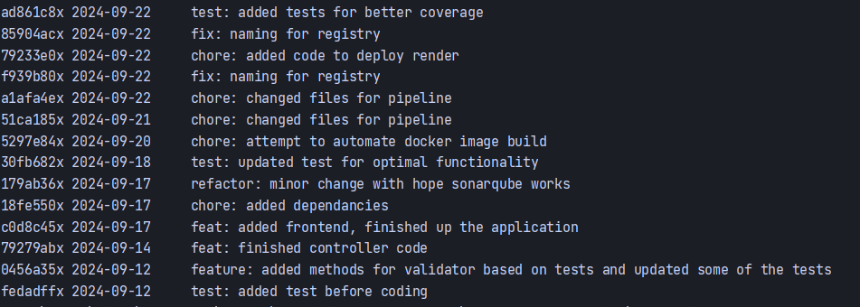
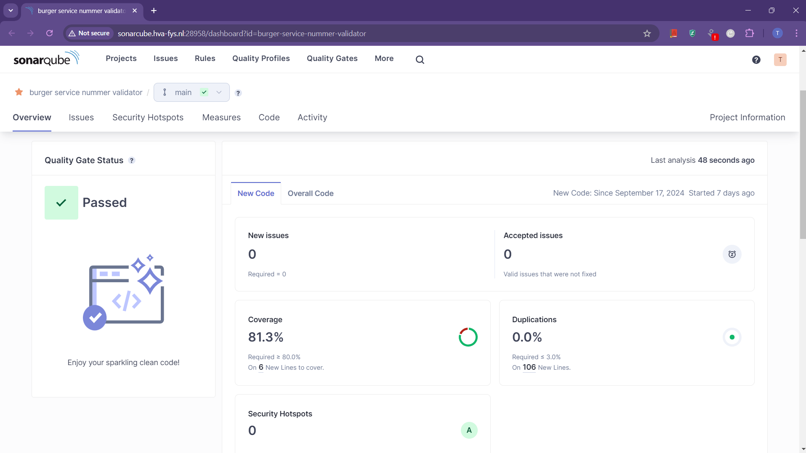
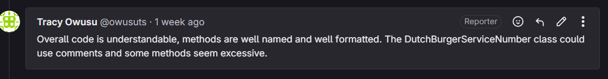

## Student Information

First Name: Tracy

Last Name: Owusu

Student number: 500819150

## Assignment 1

### 1. Git log

```
Place here the results of the following command: git log --pretty=format:"%hx %ad%x09%s" --date=short`
```


### 2. Sonarqube

A dated screenshot of the overview of the following  quality gates(https://docs.sonarqube.org/latest/user-guide/quality-gates/): Reliability, Security,Maintainability, Coverage and Duplications. Provide a short discussion of the results.

  

### 3. Test Driven Development

Your best test class code snippets with a rationale why the unit tests are “good” tests.  Provide a link to the Test class and the class under test in Git.

```java
Add your code snippets here.
```

[link-to-your-class-under-test](/somerepo/path-to-file)
- https://gitlab.fdmci.hva.nl/se-specialization-2024-1/tse2/tracy-owusu/workshop-testing/burger-service-nummer-validator/-/blob/main/src/main/java/com/example/bsnvalidator/BsnValidator.java?ref_type=heads
- https://gitlab.fdmci.hva.nl/se-specialization-2024-1/tse2/tracy-owusu/workshop-testing/burger-service-nummer-validator/-/blob/main/src/main/java/com/example/bsnvalidator/BsnValidatorController.java?ref_type=heads

[link-to-your-test-class](/somerepo/path-to-file)
- https://gitlab.fdmci.hva.nl/se-specialization-2024-1/tse2/tracy-owusu/workshop-testing/burger-service-nummer-validator/-/blob/main/src/test/java/com/example/bsnvalidator/BsnValidatorControllerTests.java?ref_type=heads
- https://gitlab.fdmci.hva.nl/se-specialization-2024-1/tse2/tracy-owusu/workshop-testing/burger-service-nummer-validator/-/blob/main/src/test/java/com/example/bsnvalidator/BsnValidatorTests.java?ref_type=heads

### 4. Code Reviews

Screenshots of the code reviews you have performed on code of another student as comments in Gitlab: Provide a link to the comments in Gitlab.


https://gitlab.fdmci.hva.nl/se-specialization-2024-1/tse2/miriam-yanku/workshop-2/springbootbsnvalidator/-/merge_requests/1


